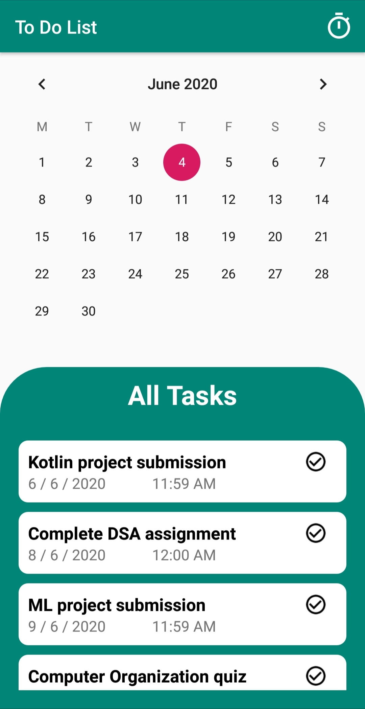

# To-Do-List
This android app was created as part of '30 Days of Kotlin with Google Developers'  
&nbsp;&nbsp;&nbsp;&nbsp;&nbsp;&nbsp; 
 
### Working
<ol>
  <li>Tap on the calendar date on which you have to add a new task</li>
  <li>Set name for the task and set time as a task deadline</li>
  <li>The task is added to the main task list</li>
  <li>Tap on the Timer icon on the action bar to open Pomodoro Technique screen</li>
</ol>

## Pomodoro Technique
**Source :** https://en.wikipedia.org/wiki/Pomodoro_Technique 
The Pomodoro Technique is a time management method developed by Francesco Cirillo in the late 1980s. 
The technique uses a timer to break down work into intervals, traditionally 25 minutes in length, separated by short breaks. 
Each interval is known as a pomodoro, from the Italian word for 'tomato', after the tomato-shaped kitchen timer that Cirillo 
used as a university student. 
### Working
<ol>
  <li>Tap on the "START TASK" button to start the 25 minute timer</li>
  <li>Tap on the "PAUSE TASK" button to pause the timer</li>
  <li>After 25 minute timer ends, it switches to a 5 minute timer with similar Start/Pause buttons</li>
  <li>Tap on the "RESTART POMODORO" button to reset it to the 25 minute timer</li>
</ol>

## Features
<ul>
  <li>Calendar View : To select the date for the task</li>
  <li>Recycler View : To show the list of tasks with 'Complete' button to remove completed tasks from the list</li>
  <li>Custom Alert Dialog : To set name and time for the task</li>
  <li>Custom Count Down Timer : A 25 minute and 5 minute timer for easy application of Pomodoro Technique</li>
  <li>Additionaly : Constraint and Linear Layouts, rounded borders for buttons and textboxes, etc.</li>
</ul>
